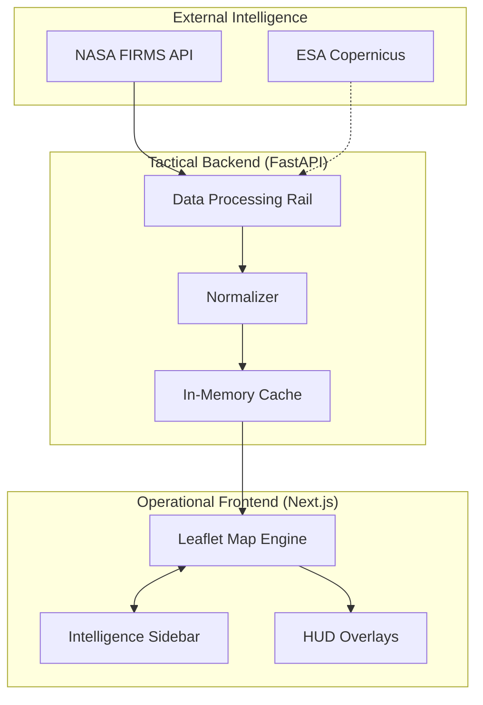

# 🛰️ PoC #26 - Wildfire Hotspot Monitor


## 📌 Overview
The **Wildfire Hotspot Monitor** is a mission-critical, real-time intelligence tool designed for emergency responders to monitor global **'Thermal Anomalies'**. By utilizing advanced NASA satellite sensors, it provides a comprehensive tactical view of wildfire activity.

The application features a signature **#030712 Obsidian Black** aesthetic, optimized for high-contrast visibility in low-light command centers, ensuring that critical data points are never missed.

---

## 🏗️ The Data Rail
Our data pipeline adheres to the **Real Rails Protocol**, ensuring low-latency intelligence streaming from the world's leading space agencies:

- **NASA FIRMS (MODIS/VIIRS):** Primary source for near real-time (NRT) active fire data.
- **ESA (Copernicus):** Secondary institutional data provider for planetary monitoring and environmental assessment.

---

## ⚡ Key Features
- **Real-time Geospatial Heat Map:** Dynamic visualization of thermal hotspots with color-coded intensity markers.
- **Time-Slider Intelligence:** Monitor fire spread and growth patterns over a **24-72 hour** window to predict trajectory.
- **Geospatial Export:** Integrated **Turf.js** functionality for defining and exporting Area of Interest (AOI) reports for field teams.

---

## 🛰️ System Architecture



---

## 🎨 Obsidian Design System
The interface is built on the **Obsidian Black (#030712)** framework, prioritizing high-contrast tactical data:
- **Primary:** Electric Cyan (#38BDF8) — Real-time telemetry.
- **Critical:** Emergency Red (#FF4136) — High-confidence thermal anomalies.
- **Warning:** Tactical Amber (#F59E0B) — Moderate intensity detections.


---

## 🛠️ Technical Stack

### **Frontend**
- **Framework:** Next.js 14+ (App Router)
- **Language:** TypeScript
- **Styling:** Tailwind CSS
- **Mapping:** Leaflet / Mapbox GL JS

### **Backend**
- **API:** Python FastAPI
- **Data Processing:** Pandas
- **Runtime:** Uvicorn

---

## 🚀 Setup Instructions

### **Step 1: Environment Setup**
Create a `.env` file in the `backend/` directory and include your NASA FIRMS API credentials:
```env
NASA_API_KEY=your_api_key_here
```

### **Step 2: Install Backend Dependencies**
Navigate to the `backend/` directory and run:
```bash
pip install -r requirements.txt
```

### **Step 3: Launch FastAPI Server**
Navigate to the `backend/` directory and start the service:
```bash
cd backend
python -m uvicorn main:app --reload
```

### **Step 4: Install Frontend Dependencies**
In the root directory, run:
```bash
npm install
```

### **Step 5: Launch Dashboard**
Start the Next.js development server:
```bash
npm run dev
```

---

## 📦 Dependencies List

| Layer | Dependency | Purpose |
| :--- | :--- | :--- |
| **Backend** | `fastapi` | High-performance API framework |
| **Backend** | `uvicorn` | ASGI server implementation |
| **Backend** | `pandas` | Data manipulation & cleaning |
| **Backend** | `requests` | HTTP client for NASA API |
| **Frontend** | `lucide-react` | Professional iconography |
| **Frontend** | `leaflet` | Interactive map engine |
| **Frontend** | `turf` | Advanced geospatial analysis |

---
*Built for PoC #26 - Real Rails Protocol.*
